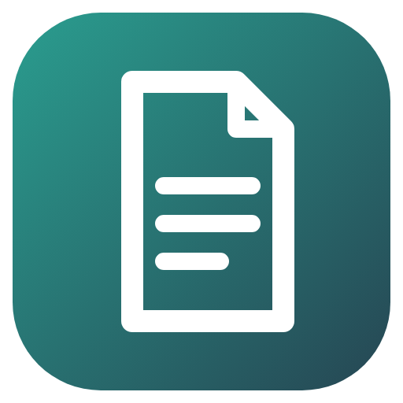

<p align="center"></p>

<h1 align="center">Chat Export to LLM</h1>

<p align="center">Command-line converter that turns Telegram JSON and Discord HTML chat exports into clean .docx files for NotebookLM and other LLM and document tools: one paragraph per message with time, sender and text.</p>

<p align="center"><a href="https://github.com/milkycloud-dev/telegram-exported-chat-to-llm/actions/workflows/release.yml"></a></p>

<p align="center"><a href="#english">English</a> | <a href="#русский">Русский</a></p>

<a id="english"></a>

## English

### What it does

Chat exports are made for viewing, not for analysis: Telegram gives nested JSON, DiscordChatExporter gives heavy HTML. Loaded into an LLM as they are, they waste context on markup. The converter keeps only what matters and writes it to Word format, which NotebookLM and most document tools accept.

Output, one paragraph per message:

> **[2026-03-28 14:30:00] Username:** Message text [Photo]

### Inputs

| Source | File | Notes |
|---|---|---|
| Telegram Desktop | `result.json` (JSON export) | text entities are flattened to plain text |
| Discord | `discord-chat.html` from DiscordChatExporter | custom emoji become their `alt` text or `[Emoji]` |

Attachments are replaced with markers: `[Photo]`, `[Image]`, `[Sticker]`, `[Voice Message]`, `[Video]`, `[Video Message]`, `[File]`.

### Usage

```bash
pip install -r requirements.txt
python convert_to_llm.py /path/to/export/folder
```

The folder is searched for `result.json` and `discord-chat.html`; each found file becomes a `.docx` next to it. To pick files and output names:

```bash
python convert_to_llm.py --telegram result.json --telegram-out telegram_chat.docx
python convert_to_llm.py --discord discord-chat.html --discord-out discord_chat.docx
```

Requires Python 3.8 or newer, `python-docx` and `beautifulsoup4`; when they are missing the script installs them with pip on start. The release builds need no Python.

### Releases

A tag `v*` builds `ChatToLLM_Windows.zip` and `ChatToLLM_Linux.tar.gz` with PyInstaller on GitHub Actions and publishes them with the notes from [CHANGELOG.md](CHANGELOG.md).

### License

Proprietary, all rights reserved. Running the official release builds is allowed; see [LICENSE](LICENSE) for the full terms.

<a id="русский"></a>

## Русский

### Что делает

Выгрузки чатов сделаны для просмотра, а не для анализа: Telegram отдаёт вложенный JSON, DiscordChatExporter тяжёлый HTML. Если загрузить их в LLM как есть, контекст уходит на разметку. Конвертер оставляет только нужное и пишет в формат Word, который принимают NotebookLM и большинство инструментов для документов.

Результат, по абзацу на сообщение:

> **[2026-03-28 14:30:00] Username:** Текст сообщения [Photo]

### Входные данные

| Источник | Файл | Примечание |
|---|---|---|
| Telegram Desktop | `result.json` (выгрузка в JSON) | форматирование текста сводится к обычному тексту |
| Discord | `discord-chat.html` из DiscordChatExporter | свои эмодзи заменяются текстом из `alt` или `[Emoji]` |

Вложения заменяются метками: `[Photo]`, `[Image]`, `[Sticker]`, `[Voice Message]`, `[Video]`, `[Video Message]`, `[File]`.

### Использование

```bash
pip install -r requirements.txt
python convert_to_llm.py /path/to/export/folder
```

В папке ищутся `result.json` и `discord-chat.html`; для каждого найденного файла рядом появляется `.docx`. Чтобы указать файлы и имена результата:

```bash
python convert_to_llm.py --telegram result.json --telegram-out telegram_chat.docx
python convert_to_llm.py --discord discord-chat.html --discord-out discord_chat.docx
```

Нужен Python 3.8 или новее, `python-docx` и `beautifulsoup4`; если их нет, скрипт сам ставит их через pip при запуске. Сборкам из релизов Python не нужен.

### Релизы

Тег `v*` собирает `ChatToLLM_Windows.zip` и `ChatToLLM_Linux.tar.gz` через PyInstaller в GitHub Actions и публикует их с описанием из [CHANGELOG.md](CHANGELOG.md).

### Лицензия

Проприетарная, все права защищены. Запуск официальных сборок из релизов разрешён; полные условия в [LICENSE](LICENSE).
